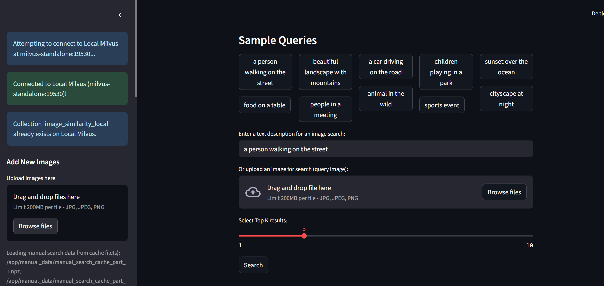
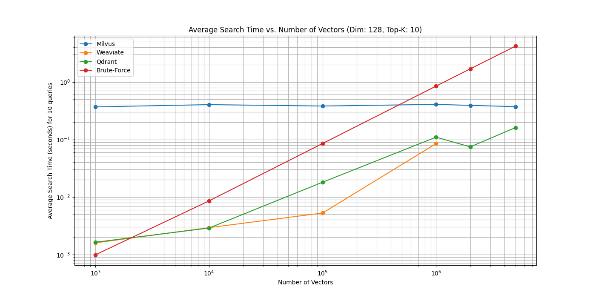
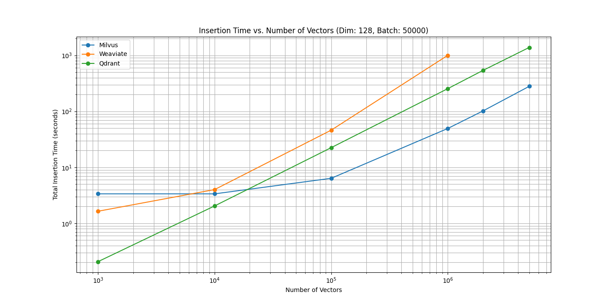

# Hệ thống So sánh Hiệu suất Cơ sở Dữ liệu Vector

Dự án này tập trung vào việc so sánh hiệu suất và khả năng thực tế của các cơ sở dữ liệu vector phổ biến như Milvus, Qdrant và Weaviate trong việc lưu trữ và tìm kiếm tương tự hình ảnh phim.



## Tổng quan

Dự án này cung cấp:

1. So sánh hiệu suất chuyên sâu giữa các cơ sở dữ liệu vector
2. Demo ứng dụng tìm kiếm phim tương tự bằng hình ảnh
3. Docker setup để dễ dàng triển khai và thử nghiệm với các cơ sở dữ liệu khác nhau

## Cài đặt

### Yêu cầu

- Docker và Docker Compose
- Python 3.8+
- Các thư viện Python được liệt kê trong `requirements.txt`

### Cài đặt môi trường

1. Clone repository:
```bash
git clone [URL của repository của bạn]
cd Demo_DoAn
```

2. Cài đặt các thư viện Python cần thiết:
```bash
pip install -r requirements.txt
```

3. Khởi động các cơ sở dữ liệu bằng Docker Compose:

```bash
# Khởi động tất cả các cơ sở dữ liệu
cd vector_database_docker
docker-compose -f all_databases_docker_compose.yml up -d

# Hoặc khởi động riêng từng cơ sở dữ liệu
cd milvus_docker
docker-compose up -d

cd ../qdrant_docker
docker-compose up -d

cd ../weaviate_docker
docker-compose up -d
```

## Sử dụng

### Chạy ứng dụng Streamlit

```bash
streamlit run app.py
```

### Thực hiện các thí nghiệm so sánh hiệu suất

Dự án bao gồm các notebook Jupyter để thực hiện các thí nghiệm so sánh:

- `vector_db_performance_comparison.ipynb`: So sánh hiệu suất giữa các cơ sở dữ liệu vector
- `vector_db_practical_demo.ipynb`: Demo thực tế về tìm kiếm tương tự với hình ảnh phim

### Chuẩn bị dữ liệu

Dự án cung cấp các tiện ích để tạo và nhập dữ liệu:

```bash
# Tạo dữ liệu JSON để nhập vào Milvus
python -m utils.generate_milvus_import_json

# Nhập dữ liệu đã tạo vào Milvus
python -m utils.import_generated_data_to_milvus

# Chuẩn bị dữ liệu tìm kiếm thủ công
python -m utils.prepare_manual_search_data
```

## Cấu trúc dự án

```
app.py                              # Ứng dụng Streamlit
docker-compose.yml                  # Docker Compose chính
Dockerfile                          # Dockerfile chính
requirements.txt                    # Các thư viện Python cần thiết
vector_db_performance_comparison.ipynb  # Notebook so sánh hiệu suất
vector_db_practical_demo.ipynb      # Notebook demo thực tế
weaviate_clip_docker_compose.yml    # Docker Compose cho Weaviate với CLIP
assets/                             # Hình ảnh và tài nguyên
data/                               # Dữ liệu cho Milvus
drant_docker/                       # Cài đặt Docker cho Qdrant
local_embeddings/                   # Embeddings được lưu trữ cục bộ
local_images/                       # Hình ảnh phim mẫu cho tìm kiếm
manual_data/                        # Dữ liệu tìm kiếm thủ công
milvus_docker/                      # Cài đặt Docker cho Milvus
performance_results/                # Kết quả so sánh hiệu suất
utils/                              # Các tiện ích cho dự án
vector_database_docker/             # Cài đặt Docker cho tất cả các DB
weaviate_docker/                    # Cài đặt Docker cho Weaviate
```

## Kết quả thí nghiệm

### Thời gian tìm kiếm


### Thời gian chèn dữ liệu
